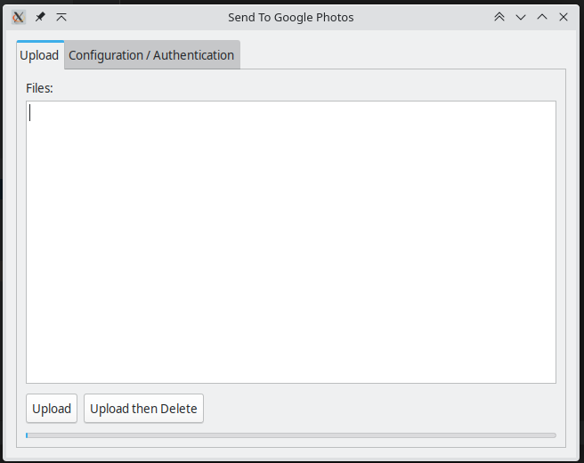
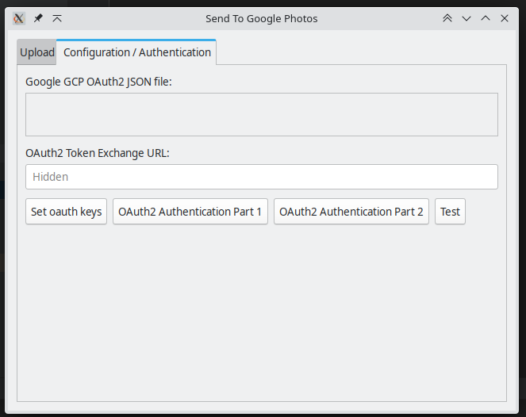

# Send-to-google-photos

Send to Google photos, desktop app.





# Getting it to work

2 Parts:
1. Install
2. OAuth2 configuration

## Install

I am going to make this easier soon... Maybe. Happy for PRs

### Windows

Requires manual install. 
1. Put in a folder that is preferably not your Downloads folder.
2. In Windows put a shortcut to where ever you have put the exe in your "Send to" folder. https://www.pcmag.com/how-to/how-to-customize-the-send-to-menu-in-windows

### Linux

1. Install, if you can use the deb, apk or rpm
2. Create a `.desktop` file in the correct location: `~/.local/share/kservices5/ServiceMenus/send-to-google-photos.desktop` With the contents:
    ```
    [Desktop Entry]
   Comment[en_AU]=
   Comment=
   Exec=$$$UPDATE PATH HERE$$$$
   GenericName[en_AU]=
   GenericName=
   Icon=kphotoalbum
   Name[en_AU]=Send To Google Photos
   Name=Send To Google Photos
   NoDisplay=false
   Path=
   StartupNotify=true
   Terminal=false
   TerminalOptions=
   Type=Application
   X-DBUS-ServiceName=
   X-DBUS-StartupType=none
   X-KDE-SubstituteUID=false
   X-KDE-Username=
   X-DFM-MenuTypes=MultiFile;MultiFileDirs;
   Actions=sendToGP;
   ServiceTypes=KonqPopupMenu/Plugin
   Type=Service
   MimeType=image/jpeg;image/png;image/svg+xml;image/svg+xml-compressed;image/bmp;image/webp;image/tiff;
   X-KDE-Priority=TopLevel
   
   [Desktop Action sendToGP]
   Name=Send to google photos
   Exec=$$$UPDATE PATH HERE$$$$ %F
   Icon=kphotoalbum

    ```
Remember to replace `$$$UPDATE PATH HERE$$$$` with the fully qualified file path

# Issues

There are a couple. Mostly should relate to: https://bitbucket.org/rj/goey/src/master/ or the way you install it.